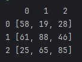

<div align="center">

# _Matrizes bidimensionais_ <br> & <br> _Algoritmos de ordenação_
</div>

### Tópicos:

- <a href="#matrizbi">**1. Matriz bidimensional**</a>
- <a href="#algOrd">**2. Algoritmos de ordenação**</a>
    - <a href="#bbs">**2.1. Bubble Sort**</a>
    - <a href="#mSort">**2.2. Merge Sort**</a>
- <a href="#codigo">**Estrutura do código**</a>
    - <a href="#mHandler">**MatrizHandler**</a>
    - <a href="#mainExec">**Main (execução)**</a>
<hr>
<div id="matrizbi" align="center">


### Matriz Bidimensional
</div>

Também chamada de matriz 2D, é uma estrutura de dados organizada em linhas e colunas, tendo um formato parecido com uma tabela. Cada elemento da matriz é identificado por dois índices: linha e coluna, que servem para acessar o elemento dentro da matriz.

#### Exemplo de instância de uma matriz bidimensional (Java):

```java
int[][] matriz = new int[3][4];
```

Por padrão, o primeiro valor é o da linha e o segundo da coluna, onde podemos ver uma matriz com tamanho de 3 linhas e 4 colunas.

#### Visualização do array criado no exemplo anterior:

| x   | 0   | 1   | 2   | 3   |
| --- | --- | --- | --- | --- |
| 0   | 0   | 0   | 0   | 0   |
| 1   | 0   | 0   | 0   | 0   |
| 2   | 0   | 0   | 0   | 0   |

<br>

#### Em código...
Podemos visualizar uma matriz como um **_array de arrays_**, e para manipularmos o valor dentro desse objeto, precisamos acessar um array _duas vezes seguidas_, segue o exemplo:

```java
// acessando o elemendo na linha 1
matriz[1];
// retorno esperado: [0, 0, 0, 0]

// acessando o elemento na linha 1, coluna 1
matriz[1][1];
// retorno esperado: 0

// alterando o elemento da linha 1, coluna 1
matriz[1][1] = 5;
```

#### Visualização da tabela após alteração:

| x   | 0   | 1   | 2   | 3   |
| --- | --- | --- | --- | --- |
| 0   | 0   | 0   | 0   | 0   |
| 1   | 0   | 5   | 0   | 0   |
| 2   | 0   | 0   | 0   | 0   |

<hr>
<div id="algOrd" align="center">


### Algoritmos de ordenação
</div>

Os algoritmos de ordenação são métodos utilizados para organizar um conjunto de elementos em uma sequência ordenada, como crescente ou decrescente. Eles são fundamentais em Estruturas de Dados, pois facilitam buscas, análises e outras operações.

Eles possuem duas categorias:
- **Iterativos:** quando fazem a ordenação usando loops **_while_** e **_for_**.
- **Recursivos:** quando fazem uso de **_recursão_** (chamar a função dentro dela mesma) para ordenar a lista.

Veremos um exemplo de cada sendo explicado e aplicado no código.

<hr>
<div id="bbs" align="center">


### Bubble Sort
</div>

O Bubble Sort é um algoritmo de ordenação simples e iterativa, pouco eficiente para grandes listas. Ele funciona comparando pares de elementos adjacentes e os trocando de posição se estiverem fora de ordem. Esse processo se repete várias vezes até que a lista esteja totalmente ordenada.

#### Código (Java):
```java
public void bubbleSort(int[] arr) {
        int n = arr.length;
        for (int i = 0; i < n - 1; i++) {
            for (int j = 0; j < n - i - 1; j++) {
                if (arr[j] > arr[j + 1]) {
                    int temp = arr[j];
                    arr[j] = arr[j + 1];
                    arr[j + 1] = temp;
                }
            }
        }
    }
```

<hr>
<div id="mSort" align="center">


### Merge Sort
</div>

O Merge Sort é um algoritmo de ordenação eficiente, baseado no paradigma Dividir para Conquistar. Ele divide a lista em partes menores, ordena cada parte separadamente e depois combina (merge) as partes de volta em uma única lista ordenada!

#### Exemplo do passo a passo da ordenação:
```java
// [4, 23, 9, 1, 70, 50, 87, 6]

// primeira divisão
// [4, 23, 9, 1] e [70, 50, 87, 6]

// segunda divisão
// [4, 23] e [9, 1] | [70, 50] e [87, 6]

// terceira divisão
// [4], [23], [9] e [1] | [70], [50], [87] e [6]

// primeiro merge
// [4, 23] e [1, 9] | [50, 70] e [6, 87]

// segundo merge
// [1, 4, 9, 23] e [6, 50, 70, 87]

// terceiro merge (ordenada)
// [1, 4, 6, 9, 23, 50, 70, 87]
```

#### Código (Java):
```java
public static void mergeSort(int[] vetor, int inicio, int fim) {
        if (inicio < fim) {
            int meio = (inicio + fim) / 2;
            mergeSort(vetor, inicio, meio);
            mergeSort(vetor, meio + 1, fim);
            merge(vetor, inicio, meio, fim);
        }
    }

    public static void merge(int[] vetor, int inicio, int meio, int fim) {
        // Passo 1: Determinar os tamanhos dos dois subarrays
        int n1 = meio - inicio + 1;
        int n2 = fim - meio;

        // Passo 2: Criar arrays temporários para armazenar os subarrays
        int[] esquerda = new int[n1];
        int[] direita = new int[n2];

        // Passo 3: Copiar os dados para os arrays temporários
        for (int i = 0; i < n1; i++)
            esquerda[i] = vetor[inicio + i];
        for (int j = 0; j < n2; j++)
            direita[j] = vetor[meio + 1 + j];

        // Passo 4: Mesclar os arrays temporários de volta no array original

        int i = 0, j = 0;
        int k = inicio;
        while (i < n1 && j < n2) {
            if (esquerda[i] <= direita[j]) {
                vetor[k] = esquerda[i];
                i++;
            } else {
                vetor[k] = direita[j];
                j++;
            }
            k++;
        }

        // Passo 5: Copiar os elementos restantes de esquerda[], se houver
        while (i < n1) {
            vetor[k] = esquerda[i];
            i++;
            k++;
        }

        // Passo 6: Copiar os elementos restantes de direita[], se houver
        while (j < n2) {
            vetor[k] = direita[j];
            j++;
            k++;
        }
    }
```

<hr>
<div id="codigo" align="center">


### Estrutura do código
</div>

<div id="mHandler">

## Classe MatrizHandler
</div>

### **Métodos de funcionamento da classe**

---
#### **Construtor:** 
O construtor da classe pede um inteiro para o numero de linhas e para o numero de colunas da matriz.

---
#### **preencherManual()**
Itera com dois loops for aninhados todos os elementos da matriz, informando a posição e pedindo o valor que deseja atribuir à posição.

---
#### **preencherAuto()**
Itera com dois loops for aninhados todos os elementos da matriz, atribuindo à posição um valor aleatório entre 1 e 100.

---
#### **inserirValor()**
Usa o <a href="#printarMatriz">método auxiliar _printarMatriz()_</a> para exibir o estado atual da matriz, e em seguida coleta os valores de linha, coluna e do valor novo (fazendo as verificações com o <a href="#verificaValor">método auxiliar _verificaValor()_</a>), para poder atribuir o valor novo na posição correta.

---
#### **removerValor()**
Funciona semelhante ao método anterior, exceto que não coleta um novo valor, apenas posição de linha e coluna, e troca o valor no lugar por 0.

---
#### **ordenarCompleta()**
Esse método utiliza o <a href="#merge">método de ordenação Merge Sort</a> para ordenar a matriz como se fosse uma unica lista inteira.

Exemplo:
<div style="display:flex; justify-content:space-evenly;">
<div>

matriz desordenada
|   | 0  | 1  | 2  | 3  |
|---|----|----|----|----|
| 0 | 53 | 93 | 33 | 17 |
| 1 | 75 | 96 | 13 | 68 |
| 2 | 86 | 66 | 52 |  3 |
| 3 | 94 |  7 | 49 | 61 |

</div>
<div>

matriz ordenada completa
|   | 0  | 1  | 2  | 3  |
|---|----|----|----|----|
| 0 |  3 |  7 | 13 | 17 |
| 1 | 33 | 49 | 52 | 53 |
| 2 | 61 | 66 | 68 | 75 |
| 3 | 86 | 93 | 94 | 96 |
</div>
</div>

---
#### **ordenarPorLinha()**
Esse método utiliza o <a href="#bubble">método de ordenação Bubble Sort</a> para ordenar a matriz por linhas.

Exemplo:
<div style="display:flex; justify-content:space-evenly;">
<div>

matriz desordenada
|   | 0  | 1  | 2  | 3  |
|---|----|----|----|----|
| 0 | 53 | 93 | 33 | 17 |
| 1 | 75 | 96 | 13 | 68 |
| 2 | 86 | 66 | 52 |  3 |
| 3 | 94 |  7 | 49 | 61 |

</div>
<div>

matriz ordenada por linha
|   | 0  | 1  | 2  | 3  |
|---|----|----|----|----|
| 0 | 17 | 33 | 53 | 93 |
| 1 | 13 | 68 | 75 | 96 |
| 2 |  3 | 52 | 66 | 86 |
| 3 |  7 | 49 | 61 | 94 |
</div>
</div>

---
#### **ordenarPorLinha()**
Esse método utiliza o <a href="#bubble">método de ordenação Bubble Sort</a> para ordenar a matriz por linhas.

Exemplo:
<div style="display:flex; justify-content:space-evenly;">
<div>

matriz desordenada
|   | 0  | 1  | 2  | 3  |
|---|----|----|----|----|
| 0 | 53 | 93 | 33 | 17 |
| 1 | 75 | 96 | 13 | 68 |
| 2 | 86 | 66 | 52 |  3 |
| 3 | 94 |  7 | 49 | 61 |

</div>
<div>

matriz ordenada por linha
|   | 0  | 1  | 2  | 3  |
|---|----|----|----|----|
| 0 | 17 | 33 | 53 | 93 |
| 1 | 13 | 68 | 75 | 96 |
| 2 |  3 | 52 | 66 | 86 |
| 3 |  7 | 49 | 61 | 94 |
</div>
</div>

---
#### **ordenarPorColuna()**
Esse método utiliza o <a href="#bubble">método de ordenação Bubble Sort</a> para ordenar a matriz por colunas.

Exemplo:
<div style="display:flex; justify-content:space-evenly;">
<div>

matriz desordenada
|   | 0  | 1  | 2  | 3  |
|---|----|----|----|----|
| 0 | 53 | 93 | 33 | 17 |
| 1 | 75 | 96 | 13 | 68 |
| 2 | 86 | 66 | 52 |  3 |
| 3 | 94 |  7 | 49 | 61 |

</div>
<div>

matriz ordenada por coluna
|   | 0  | 1  | 2  | 3  |
|---|----|----|----|----|
| 0 | 53 |  7 | 13 |  3 |
| 1 | 75 | 66 | 33 | 17 |
| 2 | 86 | 93 | 49 | 61 |
| 3 | 94 | 96 | 52 | 68 |
</div>
</div>

---
### **Métodos de ordenação usados**
<div id="bubble">

---
#### **bubbleSort()**
Implementação da <a href="#bbs">ordenação _Bubble Sort_</a> para ser utilizada por outros métodos, recebendo um array de inteiros.
</div>

<div id="merge">

---
#### **mergeSort() e merge()**
Implementação da <a href="#mSort">ordenação _Merge Sort_</a> para ser utilizada por outros métodos, recebendo um array de inteiros, um inteiro de início e um inteiro de fim em ambas funções.
</div>

---
### **Métodos auxiliares**

<div id="printarMatriz">

---
#### **printarMatriz()**
Utilizado quando necessário printar a matriz no console, modela o print para deixar a mesma mais legível.

Exemplo de print:



</div>

<div id="verificaValor">

---
#### **verificaValor()**
O método recebe os valores de string da posição a ser verificada e o valor.
Dentro da função, de acordo com a posição, ele faz as devidas verificações e retorna o valor quando estiver dentro dos parametros:
- **Linha:** precisa estar entre 0 e o tamanho da matriz.
- **Coluna:** precisa estar entre 0 e o tamanho do primeiro elemento (pois todos tem o mesmo tamanho, e o primeiro sempre existe).
- **Valor**: deve estar entre 0 e 100, pois são os valores que podem ser inseridos na matriz.

</div>

<div id="mainExec">

## Classe main (execução)
Inicializa a execução, criando um Scanner para ler os valores de tamanho da matriz (linhas e colunas), após isso, instancia uma matriz.

Estão comentados os métodos existentes e utilizáveis da MatrizHandler.

**OBS.: PARA UTILIZAR OS MÉTODOS DE INSERIR, REMOVER E ORDENAR, É NECESSÁRIO ANTES UTILIZAR ALGUM DOS MÉTODOS DE PREENCHER.**
</div>